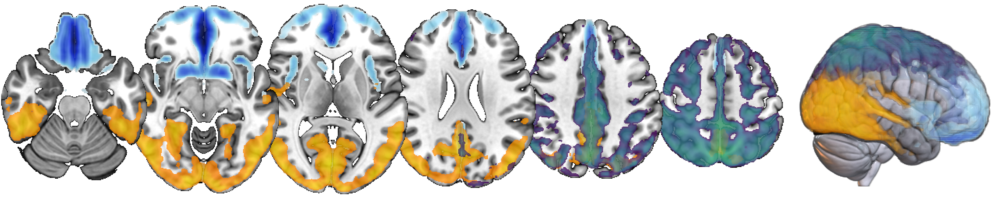

# Amyloid-β ICA components

Cortical amyloid-β PET components (frontal, parietal, occipital) derived by probabilistic independent component analysis (ICA) in the AMYPAD Prognostic & Natural History Study, provided in MNI152NLin6Asym 2mm space, together with a Python tool to register a subject's PET and T1 to MNI space and quantify component loadings by spatial regression.

## About

  

## Contents

- `components/`: component maps in MNI152NLin6Asym space at 2 mm resolution. For each component:
  - `desc-probmap`: Probability map; probabilities are derived from Mixture Modeling implemented in FSL MELODIC v3.15 (https://doi.org/10.1109/ISBI.2004.1398832)
  - `desc-zstat`: Z-statistic map
  - `desc-zstatmasked`: Z-statistic map, thresholded by 80% component probability. These are the maps used by `apply_components.py`.
- `apply_components.py`: registers a subject's T1 and PET to MNI space and regresses the masked z-statistic maps onto the PET image.
- `requirements.txt`: Python dependencies.

## Installation

Developed and tested with Python 3.11.17. Other Python 3 versions may work, provided a compatible antspyx release is available.

Optional: create a clean environment first.

    python -m venv .venv
    source .venv/bin/activate        # Windows (PowerShell): .venv\Scripts\Activate.ps1

    pip install -r requirements.txt

Dependencies: antspyx, numpy, pandas, templateflow. On first use, the MNI152NLin6Asym 2 mm T1w template is downloaded via TemplateFlow (internet access needed), unless a local template is given with `--template`.

## Usage

    python apply_components.py --subject sub-001 --t1 sub-001_T1w.nii.gz --pet sub-001_pet-suvr.nii.gz --output-dir results --save-mni

### Inputs

- Subject-space T1-weighted image (.nii.gz)
- Subject-space PET image (.nii.gz), quantified as SUVR with reference region whole cerebellum. A 4D PET is averaged over time.

### Options

Required:

    --subject SUBJECT        Subject name/ID, written to the CSV and used in output file names
    --t1 T1                  Subject-space T1 image (.nii.gz)
    --pet PET                Subject-space PET image (.nii.gz)

Optional:

    --output-dir DIR         Directory for all outputs (default: current directory)
    --output FILE            CSV filename, relative to --output-dir; an absolute path overrides
                             --output-dir (default: <subject>_desc-components_betas.csv)
    --append                 Append a row to an existing CSV instead of overwriting it
                             (for batch runs; the header is written only when the file is created)
    --save-mni               Also save the MNI-space PET and T1 images
    --components-dir DIR     Directory with the component maps (default: components/ next to the script)
    --template FILE          MNI152NLin6Asym 2 mm T1w template (default: fetched via TemplateFlow)
    --mask FILE              Mask in MNI space for the regression (default: union of all
                             non-zero voxels of the zstatmasked component maps)
    -h, --help               Show the help message

### Batch example

    for s in sub-001 sub-002 sub-003; do
      python apply_components.py --subject $s --t1 data/${s}_T1w.nii.gz --pet data/${s}_pet.nii.gz \
        --output-dir results --output all_subjects_betas.csv --append
    done

Remove any existing `all_subjects_betas.csv` before starting a new batch.

## Outputs

All files are written to `--output-dir`:

- CSV with one row per subject: `subject`, `intercept`, `beta_<component>` (one column per component, e.g. `beta_frontal`, `beta_occipital`, `beta_parietal`), `n_voxels` (number of voxels in the regression)
- `transforms/`: ANTs transforms (T1 to MNI, PET to T1), named by subject
- With `--save-mni`:
  - `<subject>_space-MNI152NLin6Asym_res-2_pet.nii.gz`
  - `<subject>_space-MNI152NLin6Asym_res-2_T1w.nii.gz`

## Method

1. The T1 is registered to the MNI152NLin6Asym 2 mm T1w template (ANTs SyN: affine plus nonlinear).
2. The PET is rigidly registered to the subject's T1 (ANTs rigid, Mattes mutual information).
3. The PET is resampled to MNI space in a single step by composing both transforms (linear interpolation).
4. The MNI-space PET values are regressed on all zstatmasked component maps simultaneously (ordinary least squares, with intercept), within the mask. Voxels where the PET is zero or non-finite are excluded. The regression coefficients are the component loadings.

The component maps must lie on the same 2 mm MNI152NLin6Asym grid as the template; the script stops with an error otherwise.

## File naming

Component files follow a BIDS-inspired convention, for example:

    atlas-AmyloidICA_space-MNI152NLin6Asym_res-2_label-frontal_desc-zstatmasked_statmap.nii.gz

where `label` is the component (frontal, occipital, parietal) and `desc` the map type (probmap, zstat, zstatmasked).

## License

The component maps, code and documentation in this repository are released under the Creative Commons CC0 1.0 Universal Public Domain Dedication (see [CC0 1.0 Universal](https://creativecommons.org/publicdomain/zero/1.0/)). To the extent possible under law, the authors have waived all copyright and related rights, so the work may be copied, modified, distributed and used, including for commercial purposes, without asking permission. Citation is not a legal requirement under CC0 but is requested as good scholarly practice (see Citation below).

## Citation

If you use these components or this code, please cite: _TO BE UPDATED_.

## Contact

Leo Pieperhoff

l.pieperhoff@amsterdamumc.nl

https://github.com/lpieperhoff